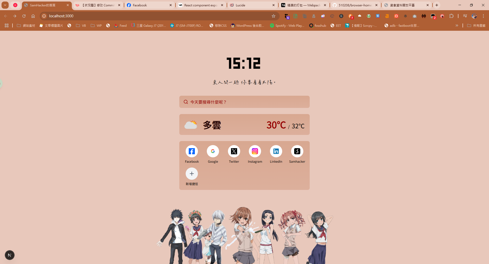

<p align="center"></p>

<h1 align="center">SamHacker 的瀏覽器首頁</strong></h1>

<p align="center">
   <a href="https://discord.gg/CWCjhRGJ2e">
      
   </a>
   <a href="https://github.com/510208">
      
   </a>
   <a href="https://github.com/510208/browser-homepage">
      
   </a>
</p>

<p align="center">
   <a href="https://vercel.com/new/clone?repository-url=https%3A%2F%2Fgithub.com%2F510208%2Fbrowser-homepage&env=CWA_OPENAPI_AUTHCODE,CWA_OPENAPI_ENDPOINT,MOE_DATA_APIKEY,MOE_DATA_ENDPOINT&envDescription=%E5%9C%A8%E8%AE%80%E6%88%91%E6%AA%94%E6%A1%88%E4%B8%AD%E6%8F%90%E5%8F%8A%E9%9C%80%E6%96%B0%E5%A2%9E%E7%9A%84%E7%92%B0%E5%A2%83%E8%AE%8A%E6%95%B8&envLink=https%3A%2F%2Fgithub.com%2F510208%2Fbrowser-homepage%2Fblob%2Fmain%2FREADME.md&project-name=samhacker-browser-homepage">
      
   </a>
</p>

## 🖊️ 簡介

最近在練習寫 Next.js（好不容易總算學成當然要分享），於是就想起很想改的 Chrome 首頁。起先用 Figma 稍稍打了個版，然後丟給 v0 先幫我把打的版切出來，然後開始東改西改，然後就有了這個。

這是一個使用 Next.js、TypeScript 和 Tailwind CSS 打造的個人化瀏覽器首頁，旨在提供天氣資訊、每日佳句、快速捷徑等功能。

## ✨ 功能特色

- 🕒 **即時時鐘** - 顯示當前時間
- 🌤️ **天氣資訊** - 整合台灣中央氣象署資料
- 💭 **每日佳句** - 隨機顯示勵志或有趣的句子
- 🔍 **智慧搜尋** - 支援 Google 搜尋建議，鍵盤導航
- 🚀 **快速捷徑** - 可自定義的常用網站連結
- 🎨 **完全可自定義** - 透過配置文件輕鬆修改外觀
- ⌨️ **鍵盤導航** - 基本的鍵盤快捷鍵支援（我就爛）
- 📱 **響應式設計** - 支援各種螢幕尺寸

## 📖 文檔

- [📋 配置文件說明](docs/configuration.md) - 了解如何自定義首頁外觀
- [🚀 部署指南](docs/deployment.md) - 如何部署到各種平台
- [🔧 開發指南](#基本架構) - 技術架構和開發環境設定

## 〽️ 快速開始

### 自定義您的首頁

本專案採用 TypeScript 配置文件系統，您可以輕鬆自定義首頁的外觀：

1. **修改主題色彩**: 編輯 `config.ts` 中的 `theme.primaryColor`
2. **更換背景**: 修改 `theme.backgroundColor` 和背景圖片設定
3. **自定義卡片**: 調整 `cardBackground` 漸層效果

```typescript
// config.ts 範例
export const config: HomepageConfig = {
  theme: {
    primaryColor: "#960000", // 主要顏色
    backgroundColor: "#e8c8bb", // 背景顏色
    cardBackground: {
      from: "rgba(200, 137, 103, 0.6)",
      to: "rgba(218, 168, 148, 0.6)",
    },
  },
  // 更多配置選項...
};
```

📋 **[查看完整配置文件說明](docs/configuration.md)**

### 鍵盤快捷鍵（WIP）

- `↑↓` - 在搜尋建議間切換
- `Enter` - 執行搜尋
- `Esc` - 關閉搜尋建議框

## ⚒️ 部署

### 本地開發

1. 使用 pnpm 安裝依賴元件

```bash
$ pnpm install
```

2. 建立環境變數文件 `.env.local`

```properties
CWA_OPENAPI_AUTHCODE=CWA-23456789-1012-1314-1516-17181920212
CWA_OPENAPI_ENDPOINT=https://opendata.cwa.gov.tw/api/v1/rest/datastore
MOE_DATA_APIKEY=23456789-1011-1213-1415-161718192021
MOE_DATA_ENDPOINT=https://data.moenv.gov.tw/api/v2
```

3. 啟動開發環境

```bash
$ pnpm run dev
```

### 環境變數說明

- `CWA_OPENAPI_AUTHCODE`：你從[中央氣象局開放資料平台](https://opendata.cwa.gov.tw/)申請到的驗證碼
- `CWA_OPENAPI_ENDPOINT`：中央氣象局開放資料平台的 API 端點，通常保持預設即可（除非氣象局改了 API 端點）
- `MOE_DATA_APIKEY`：你從[環境部環境資料開放平台](https://data.moenv.gov.tw/)申請到的 API 金鑰
- `MOE_DATA_ENDPOINT`：環境部環境資料開放平台的 API 端點，通常保持預設即可（除非環境部改了 API 端點）

> [!WARNING]
> 請記得將上面的驗證碼與金鑰換成你申請的金鑰，否則終端會噴錯誤！

> [!WARNING]
> 如果將此專案部署於 [Vercel](https://vercel.com/) 等平台上，請記得設定環境變數，而非手動建立 `.env.local` 檔案

### 部署平台

- **[Vercel](https://vercel.com/)** (推薦) - 一鍵部署，自動 CI/CD
- **[Netlify](https://netlify.com/)** - 支援靜態網站部署
- **[GitHub Pages](https://pages.github.com/)** - 免費 GitHub 託管

📚 **[查看詳細部署指南](docs/deployment.md)**

## 🌳 基本架構

- **框架**: [Next.js](https://nextjs.org/) (App Router)
- **語言**: [TypeScript](https://www.typescriptlang.org/)
- **樣式**: [Tailwind CSS](https://tailwindcss.com/)
- **UI 元件**: [shadcn/ui](https://ui.shadcn.com/) (基於 [Radix UI](https://www.radix-ui.com/) 和 [Tailwind CSS](https://tailwindcss.com/))
- **狀態管理**: React Hooks (`useState`, `useEffect`, `useContext` 等)
- **資料獲取**: 原生 `fetch` API
- **拖放**: @dnd-kit
- **表單**: React Hook Form + Zod
- **配置系統**: TypeScript 配置文件

### 專案結構

```
browser-homepage/
├── app/                    # Next.js App Router
│   ├── api/               # API 路由
│   │   └── suggestions/   # 搜尋建議 API
│   ├── globals.css        # 全域樣式
│   ├── layout.tsx         # 根佈局
│   └── page.tsx           # 首頁
├── components/            # React 元件
│   ├── card/              # 卡片元件
│   │   ├── Clock.tsx      # 時鐘元件
│   │   ├── Quote.tsx      # 引言元件
│   │   ├── SearchBox.tsx  # 搜尋框元件
│   │   └── Weather.tsx    # 天氣元件
│   ├── ui/                # shadcn/ui 元件
│   └── DynamicStyles.tsx  # 動態樣式元件
├── docs/                  # 文檔
│   └── configuration.md   # 配置說明
├── lib/                   # 工具函數
├── public/                # 靜態資源
│   └── background/        # 背景圖片
├── types/                 # TypeScript 類型定義
│   └── config.ts          # 配置類型
├── config.ts              # 主要配置文件
└── README.md
```

1. 啟動開發環境並啟動測試伺服器（我用的是 vscode）

```bash
$ code .
$ pnpm run dev
```

## 🔧 開發

### 新增功能

1. **新增元件**: 在 `components/card/` 下建立新元件
2. **修改配置**: 更新 `types/config.ts` 和 `config.ts`
3. **API 路由**: 在 `app/api/` 下新增 API 端點
4. **樣式**: 靜態樣式放在 `globals.css`，動態樣式在 `DynamicStyles.tsx`

### 貢獻指南

1. Fork 此專案
2. 建立功能分支 (`git checkout -b feature/AmazingFeature`)
3. 提交變更 (`git commit -m 'Add some AmazingFeature'`)
4. 推送到分支 (`git push origin feature/AmazingFeature`)
5. 開啟 Pull Request

## ⚛️ 素材來源

### 天氣資料

> 瀏覽器首頁不能看天氣感覺還是有點怪怪的吧？你們不這麼認為嗎？

| 平台名稱                    | 管理者           | 連結                                                                   | 使用處                               |
| --------------------------- | ---------------- | ---------------------------------------------------------------------- | ------------------------------------ |
| 中央氣象署 OpenDataAPI      | 中央氣象署       | [https://opendata.cwa.gov.tw/index](https://opendata.cwa.gov.tw/index) | [weather.ts](lib/weather/weather.ts) |
| 政府資料開放平台 AQI 資料集 | 行政院數位發展部 | [https://data.gov.tw/dataset/40448](https://data.gov.tw/dataset/40448) | [weather.ts](lib/weather/weather.ts) |

### 每次佳句

> 不說每日是因為 API 並沒有要每日一句的意思，每次請求就換一句 awa

| 平台名稱 | 管理者   | 連結                                                                 | 使用處                                 |
| -------- | -------- | -------------------------------------------------------------------- | -------------------------------------- |
| Hikoto   | 萌创团队 | [https://hitokoto.cn/](https://hitokoto.cn/)                         | [Quote.tsx](components/card/Quote.tsx) |
| OpenCC   | BYVoid   | [https://github.com/BYVoid/OpenCC](https://github.com/BYVoid/OpenCC) | [Quote.tsx](components/card/Quote.tsx) |

### 底圖

> 御坂我老婆，誰都不准搶！！

[御坂美琴](https://zh.moegirl.org.cn/%E5%BE%A1%E5%9D%82%E7%BE%8E%E7%90%B4)、
[白井黑子](https://zh.moegirl.org.cn/%E7%99%BD%E4%BA%95%E9%BB%91%E5%AD%90)、
[婚后光子](https://zh.moegirl.org.cn/%E5%A9%9A%E5%90%8E%E5%85%89%E5%AD%90)、
[初春飾利](https://zh.moegirl.org.cn/%E5%88%9D%E6%98%A5%E9%A5%B0%E5%88%A9)、
[佐天淚子](https://zh.moegirl.org.cn/%E4%BD%90%E5%A4%A9%E6%B3%AA%E5%AD%90)、
[一方通行](https://zh.moegirl.org.cn/%E4%B8%80%E6%96%B9%E9%80%9A%E8%A1%8C)、
[上条當麻](https://zh.moegirl.org.cn/%E4%B8%8A%E6%9D%A1%E5%BD%93%E9%BA%BB)、
[20001 號（最後之作）](https://zh.moegirl.org.cn/%E6%9C%80%E5%90%8E%E4%B9%8B%E4%BD%9C)，圖片由 Canva 拼合

（怎麼越寫越像在寫科砲的角色列表了...）

## 🛌 依賴元件

> 非常感謝各位偉大的工程師前輩~~

| 專案名稱            | 維護者                          | 連結                                                                                  |
| ------------------- | ------------------------------- | ------------------------------------------------------------------------------------- |
| Next.js             | Vercel                          | [https://nextjs.org/](https://nextjs.org/)                                            |
| Tailwind            | Tailwind                        | [https://tailwindcss.com/](https://tailwindcss.com/)                                  |
| @dnd-kit/\_         | Claudéric Demers                | [https://dndkit.com/](https://dndkit.com/)                                            |
| @hookform/resolvers | React Hook Form Team            | [https://react-hook-form.com/](https://react-hook-form.com/)                          |
| @radix-ui/\_        | Radix UI Team / WorkOS          | [https://www.radix-ui.com/](https://www.radix-ui.com/)                                |
| autoprefixer        | PostCSS Team                    | [https://github.com/postcss/autoprefixer](https://github.com/nk2028/opencc-js)        |
| lucide-react        | Lucide Contributors             | [https://lucide.dev/](https://github.com/nk2028/opencc-js)                            |
| opencc-js           | NKLC / Dolphin Wood             | [NK2028/opencc-js](https://github.com/nk2028/opencc-js)                               |
| react / react-dom   | Meta (Facebook)                 | [https://react.dev/](https://react.dev/)                                              |
| tailwindcss-animate | shadcn (based on Tailwind Labs) | [jamiebuilds/tailwindcss-animate](https://github.com/jamiebuilds/tailwindcss-animate) |
| zod Colin           | McDonnell                       | [https://zod.dev/](https://zod.dev/)                                                  |


```

```
